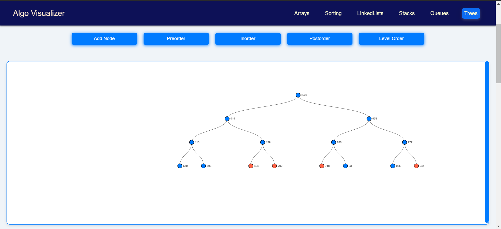
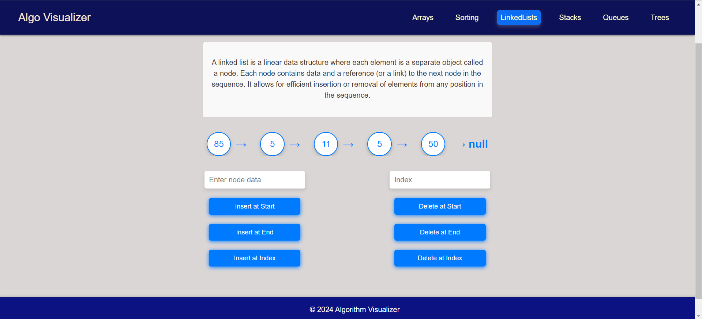
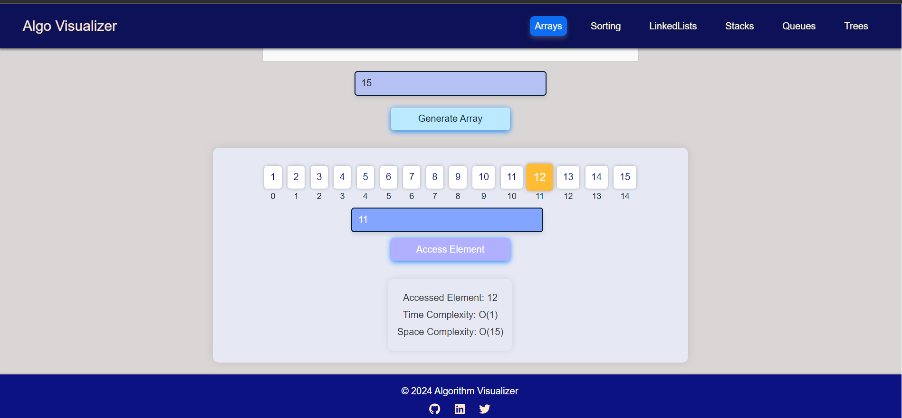
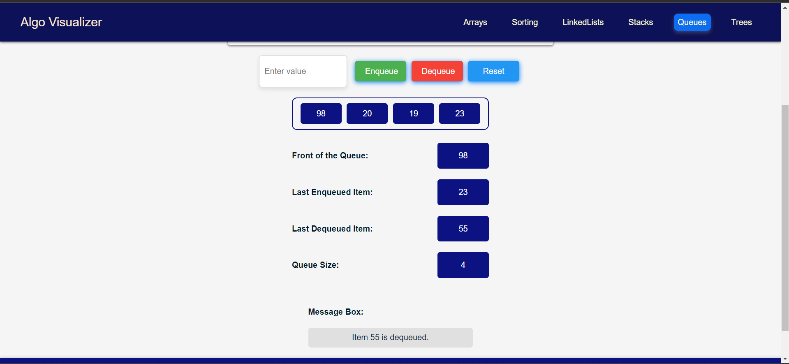
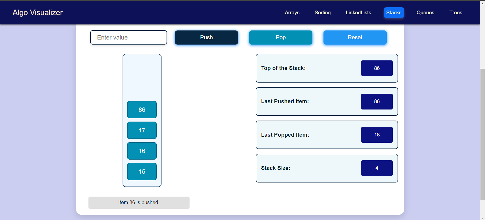
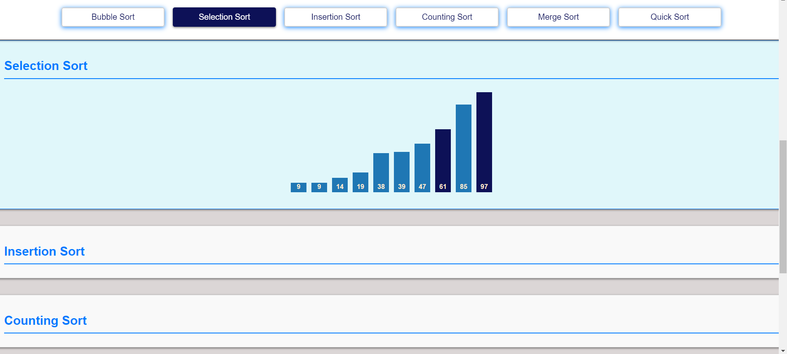

# Data Structure Visualizer

## Table of Contents
- [Project Overview](#project-overview)
- [Technologies Used](#technologies-used)
- [Features](#features)
- [Getting Started](#getting-started)
- [Usage](#usage)
- [Data Structures Implemented](#data-structures-implemented)
- [How It Works](#how-it-works)
- [Screenshots](#screenshots)
- [Future Improvements](#future-improvements)
- [Contributing](#contributing)
- [License](#license)
- [Contact](#contact)

## Project Overview
The **Data Structure Visualizer** is an interactive web application designed to help users understand fundamental data structures through visual representation. It provides dynamic visualizations for various data structures, such as binary trees, AVL trees, and binary search trees, allowing users to see how operations like insertion, deletion, and traversal work in real-time.

## Technologies Used
- **Frontend:** React, D3.js, react-d3
- **Styling:** CSS
- **Version Control:** Git, GitHub

## Features
- Interactive visualizations for various data structures
- User-friendly interface to add, remove, and manipulate tree nodes
- Real-time updates reflecting changes in the data structure
- Detailed tooltips providing information about each node
- Educational content explaining the operations and properties of each data structure

## Getting Started
To get a local copy up and running follow these simple steps.

### Prerequisites
- [Node.js](https://nodejs.org/) (>=12.x)
- [npm](https://www.npmjs.com/) (comes with Node.js)

### Installation
1. Clone the repository
   ```bash
   git clone https://github.com/yourusername/data-structure-visualizer.git
   cd data-structure-visualizer
   ```

2. Install dependencies
   ```bash
   npm install
   ```

3. Start the application
   ```bash
   npm start
   ```

4. Open your browser and visit `http://localhost:3000` to see the application in action!

## Usage
Once the application is running, you can:
- Select a data structure from the navigation menu.
- Use the provided controls to add or remove nodes from the tree.
- Watch the tree structure update in real-time, with animations showing how the structure changes.

## Data Structures Implemented
- **Arrays** : Shows how indexing and accessing of the elements works.
- **LinkedList**: Demonstrates how the insertion deletion worked.
- **Binary Trees**: Visualizes basic binary tree structures.
- **Binary Search Trees (BSTs)**: Shows how nodes are organized based on their values.
- **AVL Trees**: Demonstrates self-balancing binary search trees, highlighting rotations and rebalancing.
- **Sorting Algos** : Implemented and visualize sorting algos like  Bubble sort, selection sort, insertion sort, merge sort, quick sort etc
- **Stack and Queue**: Visualizes pop push in stack and enqueue and dequeue in queue .

## How It Works
The application utilizes **React** for building the user interface and **D3.js** (via `react-d3`) for rendering interactive data visualizations. When users perform actions (like adding or deleting nodes), the application's state is updated, triggering re-renders that reflect the current state of the tree structures.

### Key Components
- **Tree Visualization Component**: Renders the tree structure and handles user interactions.
- **Control Panel**: Provides buttons and inputs for manipulating the tree (adding/removing nodes).
- **Tooltip Component**: Displays additional information about each node on hover.

## Screenshots







## Future Improvements
- Implement additional data structures such as B-trees and graphs.
- Enhance user interactivity with drag-and-drop functionality.
- Add guided tutorials to help users learn about data structures step-by-step.
- Improve responsiveness for better mobile support.

## Contributing
Contributions are welcome! If you have suggestions or improvements, please feel free to submit a pull request or open an issue.

## License
Distributed under the MIT License. See `LICENSE` for more information.

## Contact
Dhananjay Pant - [Email](mailto:dhananjayoffc2002@example.com)

Project Link: [Live Link](https://ds-visuals.netlify.app/)

